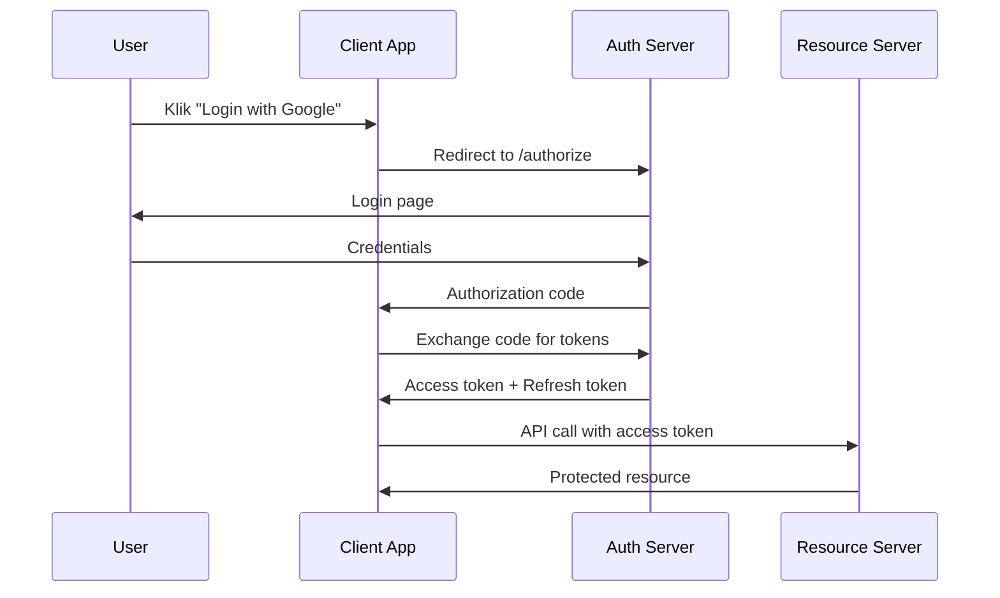

# Kompletny przewodnik po technologiach e-biznesu

## 1. Docker i konteneryzacja

### Czym jest Docker?

Docker to platforma konteneryzacji, która umożliwia pakowanie aplikacji wraz z ich zależnościami w lekkie, przenośne kontenery. Kontenery działają na zasadzie izolacji na poziomie systemu operacyjnego, dzieląc jądro z hostem, ale posiadając własne systemy plików, procesy i zasoby sieciowe.

### Podstawowe pojęcia

**Kontener** - uruchomiona instancja obrazu, zawierająca aplikację i wszystkie jej zależności

**Obraz (Image)** - szablon tylko do odczytu, służący do tworzenia kontenerów

**Dockerfile** - plik tekstowy zawierający instrukcje do budowania obrazu

**Registry** - repozytorium obrazów (np. Docker Hub)

### Podstawowe komendy Docker

```bash
# Budowanie obrazu
docker build -t nazwa-obrazu .

# Uruchamianie kontenera
docker run -d -p 8080:80 nazwa-obrazu

# Lista kontenerów
docker ps

# Zatrzymanie kontenera
docker stop container-id

# Usunięcie kontenera
docker rm container-id
```

### Docker Compose

Docker Compose pozwala na definiowanie i uruchamianie wielokontenerowych aplikacji Docker przy użyciu pliku YAML.

```yaml
version: '3.8'
services:
  web:
    build: .
    ports:
      - "8080:8080"
  database:
    image: postgres:13
    environment:
      POSTGRES_DB: myapp
      POSTGRES_PASSWORD: password
```

### Korzyści z konteneryzacji

- **Przenośność** - aplikacja działa identycznie w różnych środowiskach
- **Izolacja** - aplikacje nie wpływają na siebie nawzajem
- **Skalowalność** - łatwe skalowanie poziome
- **Efektywność zasobów** - mniejsze zużycie zasobów niż maszyny wirtualne

## 2. Scala - podstawy języka + MVC

### Wprowadzenie do Scala

Scala to hybrydowy język programowania łączący paradygmaty obiektowe i funkcyjne. Działa na JVM i jest w pełni interoperacyjny z Javą.

### Podstawowe elementy składni

```scala
// Definicja zmiennych
val niezmiennaWartosc = 10  // val - niezmienne
var zmiennaWartosc = 20     // var - zmienne

// Funkcje
def dodaj(a: Int, b: Int): Int = a + b

// Klasy
class Osoba(val imie: String, val wiek: Int) {
  def przedstawSie(): String = s"Jestem $imie, mam $wiek lat"
}

// Case classes
case class Punkt(x: Double, y: Double)

// Kolekcje
val lista = List(1, 2, 3, 4, 5)
val mapa = Map("klucz1" -> "wartość1", "klucz2" -> "wartość2")
```

### Programowanie funkcyjne w Scala

```scala
// Higher-order functions
val liczby = List(1, 2, 3, 4, 5)
val podwojone = liczby.map(_ * 2)
val parzyste = liczby.filter(_ % 2 == 0)
val suma = liczby.reduce(_ + _)

// Pattern matching
def opisz(x: Any): String = x match {
  case 1 => "jeden"
  case "hello" => "pozdrowienie"
  case true => "prawda"
  case _ => "coś innego"
}
```

### MVC w Scala (Play Framework)

Model-View-Controller to wzorzec architektoniczny oddzielający logikę biznesową od prezentacji.

**Model** - reprezentuje dane i logikę biznesową
```scala
case class Uzytkownik(id: Long, nazwa: String, email: String)

object UzytkownikRepository {
  def znajdzWszystkich(): Future[Seq[Uzytkownik]] = ???
  def znajdzPoId(id: Long): Future[Option[Uzytkownik]] = ???
}
```

**Controller** - obsługuje żądania HTTP i koordynuje między modelem a widokiem
```scala
@Singleton
class UzytkownikController @Inject()(cc: ControllerComponents) extends AbstractController(cc) {
  
  def lista() = Action.async { implicit request =>
    UzytkownikRepository.znajdzWszystkich().map { uzytkownicy =>
      Ok(Json.toJson(uzytkownicy))
    }
  }
  
  def szczegoly(id: Long) = Action.async { implicit request =>
    UzytkownikRepository.znajdzPoId(id).map {
      case Some(uzytkownik) => Ok(Json.toJson(uzytkownik))
      case None => NotFound
    }
  }
}
```

**View** - szablon do renderowania danych
```scala
@(uzytkownicy: Seq[Uzytkownik])

<h1>Lista użytkowników</h1>
<ul>
@for(uzytkownik <- uzytkownicy) {
  <li>@uzytkownik.nazwa - @uzytkownik.email</li>
}
</ul>
```

### Scala 3 - nowe funkcjonalności

- **Enums** - lepsze wsparcie dla typów wyliczeniowych
- **Union types** - typy będące sumą innych typów
- **Intersection types** - typy będące przecięciem innych typów
- **Given/using** - nowy system implicits

## 3. Go - podstawy języka + Echo + ORM

### Wprowadzenie do Go

Go to kompilowany, statycznie typowany język programowania stworzony przez Google. Charakteryzuje się prostotą, wydajnością i wbudowanym wsparciem dla współbieżności.

### Podstawowe elementy Go

```go
package main

import "fmt"

// Zmienne
var globalnaZmienna string = "Hello"

// Funkcje
func dodaj(a, b int) int {
    return a + b
}

// Struktury
type Osoba struct {
    Imie string
    Wiek int
}

// Metody
func (o Osoba) PrzedstawSie() string {
    return fmt.Sprintf("Jestem %s, mam %d lat", o.Imie, o.Wiek)
}

func main() {
    // Krótka deklaracja zmiennej
    nazwa := "Go"
    fmt.Printf("Witaj w świecie %s!\n", nazwa)
    
    // Tworzenie struktury
    osoba := Osoba{Imie: "Jan", Wiek: 30}
    fmt.Println(osoba.PrzedstawSie())
}
```

### Współbieżność w Go

```go
// Goroutines
go func() {
    fmt.Println("To działa współbieżnie")
}()

// Channels
kanal := make(chan string)
go func() {
    kanal <- "wiadomość"
}()
wiadomosc := <-kanal
```

### Echo Framework

Echo to minimalistyczny, szybki framework HTTP dla Go.

```go
package main

import (
    "net/http"
    "github.com/labstack/echo/v4"
    "github.com/labstack/echo/v4/middleware"
)

type Uzytkownik struct {
    ID    int    `json:"id"`
    Nazwa string `json:"nazwa"`
    Email string `json:"email"`
}

func main() {
    e := echo.New()
    
    // Middleware
    e.Use(middleware.Logger())
    e.Use(middleware.Recover())
    
    // Routes
    e.GET("/", func(c echo.Context) error {
        return c.String(http.StatusOK, "Hello, World!")
    })
    
    e.GET("/users/:id", getUser)
    e.POST("/users", createUser)
    
    e.Logger.Fatal(e.Start(":8080"))
}

func getUser(c echo.Context) error {
    id := c.Param("id")
    return c.JSON(http.StatusOK, map[string]string{
        "id": id,
        "nazwa": "Jan Kowalski",
    })
}

func createUser(c echo.Context) error {
    u := new(Uzytkownik)
    if err := c.Bind(u); err != nil {
        return err
    }
    return c.JSON(http.StatusCreated, u)
}
```

### ORM w Go - GORM

GORM to najpopularniejszy ORM dla Go.

```go
import (
    "gorm.io/gorm"
    "gorm.io/driver/postgres"
)

type Uzytkownik struct {
    gorm.Model
    Nazwa string `gorm:"size:255;not null;unique"`
    Email string `gorm:"size:255;not null;unique"`
}

func main() {
    // Połączenie z bazą danych
    dsn := "host=localhost user=gorm password=gorm dbname=gorm port=9920 sslmode=disable"
    db, err := gorm.Open(postgres.Open(dsn), &gorm.Config{})
    
    // Migracja
    db.AutoMigrate(&Uzytkownik{})
    
    // Tworzenie rekordu
    uzytkownik := Uzytkownik{Nazwa: "Jan", Email: "jan@example.com"}
    db.Create(&uzytkownik)
    
    // Odczytywanie
    var u Uzytkownik
    db.First(&u, 1) // znajdź użytkownika z ID = 1
    db.First(&u, "nazwa = ?", "Jan") // znajdź użytkownika o nazwie Jan
    
    // Aktualizacja
    db.Model(&u).Update("Email", "nowy@example.com")
    
    // Usuwanie
    db.Delete(&u, 1)
}
```

## 4. Kotlin - podstawy języka + Ktor

### Wprowadzenie do Kotlin

Kotlin to statycznie typowany język programowania działający na JVM, stworzony przez JetBrains. Jest w pełni interoperacyjny z Javą i charakteryzuje się zwięzłą składnią.

### Podstawowe elementy Kotlin

```kotlin
// Zmienne
val niezmiennaWartosc = 10  // val - niemutowalne
var zmiennaWartosc = 20     // var - mutowalne

// Funkcje
fun dodaj(a: Int, b: Int): Int = a + b

// Funkcje z domyślnymi parametrami
fun powitanie(imie: String = "Świecie") = "Witaj, $imie!"

// Klasy
class Osoba(val imie: String, val wiek: Int) {
    fun przedstawSie() = "Jestem $imie, mam $wiek lat"
}

// Data classes
data class Punkt(val x: Double, val y: Double)

// Null safety
var nullable: String? = null
val length = nullable?.length ?: 0

// When expression (switch w Javie)
fun opisz(x: Any) = when (x) {
    1 -> "jeden"
    "hello" -> "pozdrowienie"
    is Boolean -> "wartość logiczna"
    else -> "coś innego"
}
```

### Extension functions

```kotlin
fun String.czyPalindrom(): Boolean {
    val cleaned = this.toLowerCase().replace(" ", "")
    return cleaned == cleaned.reversed()
}

// Użycie
val wynik = "A man a plan a canal Panama".czyPalindrom()
```

### Ktor Framework

Ktor to asynchroniczny framework dla aplikacji po stronie serwera i klienta, napisany w Kotlin.

```kotlin
import io.ktor.application.*
import io.ktor.features.*
import io.ktor.gson.*
import io.ktor.http.*
import io.ktor.request.*
import io.ktor.response.*
import io.ktor.routing.*
import io.ktor.server.engine.*
import io.ktor.server.netty.*

data class Uzytkownik(val id: Int, val nazwa: String, val email: String)

fun main() {
    embeddedServer(Netty, port = 8080, host = "0.0.0.0") {
        install(ContentNegotiation) {
            gson {
                setPrettyPrinting()
            }
        }
        
        install(CORS) {
            method(HttpMethod.Options)
            method(HttpMethod.Put)
            method(HttpMethod.Delete)
            method(HttpMethod.Patch)
            header(HttpHeaders.Authorization)
            allowCredentials = true
            anyHost()
        }
        
        routing {
            get("/") {
                call.respondText("Hello World!", ContentType.Text.Plain)
            }
            
            get("/users/{id}") {
                val id = call.parameters["id"]?.toIntOrNull()
                if (id == null) {
                    call.respond(HttpStatusCode.BadRequest, "Invalid ID")
                    return@get
                }
                
                val uzytkownik = Uzytkownik(id, "Jan Kowalski", "jan@example.com")
                call.respond(uzytkownik)
            }
            
            post("/users") {
                val uzytkownik = call.receive<Uzytkownik>()
                call.respond(HttpStatusCode.Created, uzytkownik)
            }
        }
    }.start(wait = true)
}
```

### Ktor z bazą danych (Exposed ORM)

```kotlin
import org.jetbrains.exposed.dao.*
import org.jetbrains.exposed.dao.id.EntityID
import org.jetbrains.exposed.dao.id.IntIdTable
import org.jetbrains.exposed.sql.*
import org.jetbrains.exposed.sql.transactions.transaction

object Uzytkownicy : IntIdTable() {
    val nazwa = varchar("nazwa", 50)
    val email = varchar("email", 100)
}

class Uzytkownik(id: EntityID<Int>) : IntEntity(id) {
    companion object : IntEntityClass<Uzytkownik>(Uzytkownicy)
    
    var nazwa by Uzytkownicy.nazwa
    var email by Uzytkownicy.email
}

fun Application.configureDatabases() {
    Database.connect("jdbc:h2:mem:test;DB_CLOSE_DELAY=-1", driver = "org.h2.Driver")
    
    transaction {
        SchemaUtils.create(Uzytkownicy)
    }
}
```

## 5. JavaScript - podstawy języka + React Hooks + CORS

### Podstawy JavaScript

JavaScript to interpretowany język programowania, głównie używany w przeglądarkach internetowych, ale także po stronie serwera (Node.js).

```javascript
// Zmienne
const stala = 10;        // const - niezmienne
let zmienna = 20;        // let - block scope
var starySposob = 30;    // var - function scope (unikać)

// Funkcje
function dodaj(a, b) {
    return a + b;
}

// Arrow functions
const pomnoz = (a, b) => a * b;

// Obiekty
const osoba = {
    imie: "Jan",
    wiek: 30,
    przedstawSie() {
        return `Jestem ${this.imie}, mam ${this.wiek} lat`;
    }
};

// Destructuring
const { imie, wiek } = osoba;

// Spread operator
const nowy = { ...osoba, miasto: "Warszawa" };

// Promises
fetch('/api/users')
    .then(response => response.json())
    .then(data => console.log(data))
    .catch(error => console.error(error));

// Async/Await
async function pobierzUzytkownikow() {
    try {
        const response = await fetch('/api/users');
        const data = await response.json();
        return data;
    } catch (error) {
        console.error('Błąd:', error);
    }
}
```

### React Hooks

Hooks pozwalają na używanie stanu i innych funkcjonalności React w komponentach funkcyjnych.

```javascript
import React, { useState, useEffect, useContext, useReducer } from 'react';

// useState - zarządzanie stanem lokalnym
function Licznik() {
    const [licznik, setLicznik] = useState(0);
    
    return (
        <div>
            <p>Licznik: {licznik}</p>
            <button onClick={() => setLicznik(licznik + 1)}>
                Zwiększ
            </button>
        </div>
    );
}

// useEffect - efekty uboczne
function UzytkownikProfil({ userId }) {
    const [uzytkownik, setUzytkownik] = useState(null);
    const [loading, setLoading] = useState(true);
    
    useEffect(() => {
        async function pobierzUzytkownika() {
            setLoading(true);
            try {
                const response = await fetch(`/api/users/${userId}`);
                const data = await response.json();
                setUzytkownik(data);
            } catch (error) {
                console.error('Błąd pobierania użytkownika:', error);
            } finally {
                setLoading(false);
            }
        }
        
        pobierzUzytkownika();
    }, [userId]); // Dependency array
    
    if (loading) return <div>Ładowanie...</div>;
    if (!uzytkownik) return <div>Nie znaleziono użytkownika</div>;
    
    return (
        <div>
            <h1>{uzytkownik.nazwa}</h1>
            <p>{uzytkownik.email}</p>
        </div>
    );
}

// useContext - dzielenie stanu między komponentami
const TemasContext = React.createContext();

function App() {
    const [ciemnyTemas, setCiemnyTemas] = useState(false);
    
    return (
        <TemasContext.Provider value={{ ciemnyTemas, setCiemnyTemas }}>
            <Naglowek />
            <Tresc />
        </TemasContext.Provider>
    );
}

function Naglowek() {
    const { ciemnyTemas, setCiemnyTemas } = useContext(TemasContext);
    
    return (
        <header style={{ backgroundColor: ciemnyTemas ? '#333' : '#fff' }}>
            <button onClick={() => setCiemnyTemas(!ciemnyTemas)}>
                Przełącz temas
            </button>
        </header>
    );
}

// useReducer - złożone zarządzanie stanem
const initialState = { count: 0 };

function reducer(state, action) {
    switch (action.type) {
        case 'increment':
            return { count: state.count + 1 };
        case 'decrement':
            return { count: state.count - 1 };
        case 'reset':
            return initialState;
        default:
            throw new Error();
    }
}

function Licznik() {
    const [state, dispatch] = useReducer(reducer, initialState);
    
    return (
        <>
            Licznik: {state.count}
            <button onClick={() => dispatch({ type: 'increment' })}>+</button>
            <button onClick={() => dispatch({ type: 'decrement' })}>-</button>
            <button onClick={() => dispatch({ type: 'reset' })}>Reset</button>
        </>
    );
}

// Custom Hook
function useLocalStorage(key, initialValue) {
    const [storedValue, setStoredValue] = useState(() => {
        try {
            const item = window.localStorage.getItem(key);
            return item ? JSON.parse(item) : initialValue;
        } catch (error) {
            return initialValue;
        }
    });
    
    const setValue = (value) => {
        try {
            setStoredValue(value);
            window.localStorage.setItem(key, JSON.stringify(value));
        } catch (error) {
            console.error(error);
        }
    };
    
    return [storedValue, setValue];
}
```

### CORS (Cross-Origin Resource Sharing)

CORS to mechanizm zabezpieczeń implementowany przez przeglądarki, który kontroluje dostęp do zasobów z różnych domen.

**Problem CORS:**
```javascript
// To może zostać zablokowane przez CORS
fetch('https://api.externa.com/data')
    .then(response => response.json())
    .then(data => console.log(data));
```

**Rozwiązanie po stronie serwera (Express.js):**
```javascript
const express = require('express');
const cors = require('cors');
const app = express();

// Podstawowe CORS dla wszystkich route'ów
app.use(cors());

// Lub konfiguracja szczegółowa
app.use(cors({
    origin: ['http://localhost:3000', 'https://mydomain.com'],
    methods: ['GET', 'POST', 'PUT', 'DELETE'],
    allowedHeaders: ['Content-Type', 'Authorization'],
    credentials: true
}));

// Lub dla konkretnego route'a
app.get('/api/data', cors(), (req, res) => {
    res.json({ message: 'Dane z API' });
});
```

**Konfiguracja CORS w React (proxy):**
```json
// package.json
{
    "name": "my-app",
    "version": "0.1.0",
    "proxy": "http://localhost:8080",
    "dependencies": {
        // ...
    }
}
```

## 6. Testy - rodzaje testów

### Piramida testów

Piramida testów przedstawia hierarchię testów według ich liczebności i kosztów utrzymania.

**Testy jednostkowe (Unit Tests)**
- Najliczniejsze, najszybsze, najtańsze
- Testują pojedyncze funkcje/metody w izolacji
- Wysokie pokrycie kodu

```javascript
// Jest
describe('Calculator', () => {
    test('dodaje 1 + 2 aby otrzymać 3', () => {
        expect(add(1, 2)).toBe(3);
    });
    
    test('dzieli przez zero', () => {
        expect(divide(10, 0)).toBe(Infinity);
    });
});
```

**Testy integracyjne (Integration Tests)**
- Testują współpracę między komponentami
- Sprawdzają poprawność integracji

```javascript
// Testowanie API endpoint
describe('Users API', () => {
    test('GET /users zwraca listę użytkowników', async () => {
        const response = await request(app).get('/users');
        expect(response.status).toBe(200);
        expect(response.body).toHaveLength(3);
    });
    
    test('POST /users tworzy nowego użytkownika', async () => {
        const newUser = { nazwa: 'Jan', email: 'jan@test.com' };
        const response = await request(app)
            .post('/users')
            .send(newUser);
        expect(response.status).toBe(201);
        expect(response.body.nazwa).toBe('Jan');
    });
});
```

**Testy E2E (End-to-End)**
- Najmniej liczne, najwolniejsze, najdroższe
- Testują całe przepływy użytkownika
- Symulują rzeczywiste scenariusze

```javascript
// Cypress
describe('Login Flow', () => {
    it('pozwala użytkownikowi się zalogować', () => {
        cy.visit('/login');
        cy.get('[data-cy=email]').type('user@example.com');
        cy.get('[data-cy=password]').type('password123');
        cy.get('[data-cy=submit]').click();
        cy.url().should('include', '/dashboard');
        cy.get('[data-cy=welcome]').should('contain', 'Witaj');
    });
});
```

### Inne rodzaje testów

**Testy akceptacyjne**
- Sprawdzają czy aplikacja spełnia wymagania biznesowe
- Często pisane w języku naturalnym (BDD)

**Testy wydajnościowe**
- Sprawdzają szybkość i skalowalność aplikacji
- Load testing, stress testing

**Testy bezpieczeństwa**
- Wykrywają luki bezpieczeństwa
- Penetration testing, vulnerability scanning

### Techniki testowania

**Test-Driven Development (TDD)**
1. Napisz test (czerwony)
2. Napisz minimalny kod (zielony)
3. Refaktoryzuj (refactor)

**Behavior-Driven Development (BDD)**
```gherkin
Feature: Logowanie użytkownika
  Scenario: Poprawne logowanie
    Given użytkownik jest na stronie logowania
    When wprowadza poprawne dane
    Then zostaje przekierowany na dashboard
```

**Mocking i Stubbing**
```javascript
// Jest mock
const mockFetch = jest.fn();
global.fetch = mockFetch;

test('pobiera dane użytkownika', async () => {
    mockFetch.mockResolvedValue({
        json: () => Promise.resolve({ id: 1, nazwa: 'Jan' })
    });
    
    const userData = await fetchUser(1);
    expect(userData.nazwa).toBe('Jan');
    expect(mockFetch).toHaveBeenCalledWith('/api/users/1');
});
```

## 7. Sonar - statyczna analiza kodu + git hooks

### SonarQube/SonarCloud

SonarQube to platforma do ciągłej inspekcji jakości kodu, która wykonuje automatyczne przeglądy kodu w celu wykrywania błędów, zapachów kodu i luk bezpieczeństwa.

### Kluczowe metryki

**Pokrycie testami (Coverage)**
- % kodu pokrytego testami
- Pomaga zidentyfikować niepotestowane fragmenty

**Duplikacje kodu (Duplications)**
- Procent zduplikowanego kodu
- Wskazuje na potrzebę refaktoryzacji

**Maintainability Rating**
- A-E rating bazujący na długu technicznym
- Czas potrzebny na naprawę code smells

**Reliability Rating**
- A-E rating bazujący na bugach
- Prawdopodobieństwo wystąpienia błędu

**Security Rating**
- A-E rating bazujący na vulnerabilities
- Poziom zagrożenia bezpieczeństwa

### Konfiguracja SonarQube

**sonar-project.properties:**
```properties
sonar.projectKey=my-project
sonar.projectName=My Project
sonar.projectVersion=1.0
sonar.sources=src
sonar.tests=src/test
sonar.language=js
sonar.javascript.lcov.reportPaths=coverage/lcov.info
sonar.exclusions=**/node_modules/**,**/dist/**
```

**Integracja z CI/CD:**
```yaml
# GitHub Actions
name: SonarCloud
on:
  push:
    branches: [ main ]
  pull_request:
    branches: [ main ]

jobs:
  sonarcloud:
    runs-on: ubuntu-latest
    steps:
    - uses: actions/checkout@v2
      with:
        fetch-depth: 0
    - name: Install dependencies
      run: npm ci
    - name: Run tests
      run: npm run test:coverage
    - name: SonarCloud Scan
      uses: SonarSource/sonarcloud-github-action@master
      env:
        GITHUB_TOKEN: ${{ secrets.GITHUB_TOKEN }}
        SONAR_TOKEN: ${{ secrets.SONAR_TOKEN }}
```

### Git Hooks

Git hooks to skrypty uruchamiane automatycznie w określonych momentach procesu Git.

**Pre-commit hook** (zapobiega commitom o złej jakości):
```bash
#!/bin/sh
# .git/hooks/pre-commit

# Uruchom linter
npm run lint
if [ $? -ne 0 ]; then
    echo "Lint failed. Fix errors before committing."
    exit 1
fi

# Uruchom testy
npm run test
if [ $? -ne 0 ]; then
    echo "Tests failed. Fix tests before committing."
    exit 1
fi

# Sprawdź formatowanie kodu
npm run format:check
if [ $? -ne 0 ]; then
    echo "Code not formatted. Run 'npm run format' and try again."
    exit 1
fi
```

**Husky** (ułatwia zarządzanie git hooks):
```json
{
  "husky": {
    "hooks": {
      "pre-commit": "lint-staged",
      "pre-push": "npm run test",
      "commit-msg": "commitlint -E HUSKY_GIT_PARAMS"
    }
  },
  "lint-staged": {
    "*.{js,jsx,ts,tsx}": [
      "eslint --fix",
      "prettier --write",
      "git add"
    ]
  }
}
```

**Commitlint** (sprawdza format commitów):
```javascript
// commitlint.config.js
module.exports = {
  extends: ['@commitlint/config-conventional'],
  rules: {
    'type-enum': [2, 'always', [
      'feat', 'fix', 'docs', 'style', 'refactor', 
      'test', 'chore', 'revert'
    ]],
    'subject-case': [2, 'always', 'sentence-case']
  }
};
```

### Quality Gates

Quality Gates definiują kryteria, które kod musi spełnić, aby przejść przez proces CI/CD.

```javascript
// Przykładowa konfiguracja Quality Gate
{
  "conditions": [
    {
      "metric": "coverage",
      "operator": "LT",
      "threshold": "80"
    },
    {
      "metric": "duplicated_lines_density",
      "operator": "GT",
      "threshold": "3"
    },
    {
      "metric": "maintainability_rating",
      "operator": "GT",
      "threshold": "1"
    }
  ]
}
```

## 8. OAuth2 - integracja z zewnętrznymi usługami

### Czym jest OAuth2?

OAuth2 to standard autoryzacji, który pozwala aplikacjom na dostęp do zasobów użytkownika bez konieczności podawania haseł. Umożliwia bezpieczne delegowanie uprawnień dostępu.

### Role w OAuth2

**Resource Owner** - właściciel zasobu (użytkownik końcowy)

**Client** - aplikacja żądająca dostępu do zasobów

**Authorization Server** - serwer autoryzujący (np. Google, Facebook)

**Resource Server** - serwer z chronionymi zasobami

### Przepływ Authorization Code



### Implementacja OAuth2 w różnych językach

**Node.js + Express + Passport:**
```javascript
const passport = require('passport');
const GoogleStrategy = require('passport-google-oauth20').Strategy;

passport.use(new GoogleStrategy({
    clientID: process.env.GOOGLE_CLIENT_ID,
    clientSecret: process.env.GOOGLE_CLIENT_SECRET,
    callbackURL: "/auth/google/callback"
}, (accessToken, refreshToken, profile, done) => {
    // Zapisz użytkownika w bazie danych
    User.findOrCreate({
        googleId: profile.id,
        name: profile.displayName,
        email: profile.emails[0].value
    }, (err, user) => {
        return done(err, user);
    });
}));

// Routes
app.get('/auth/google',
    passport.authenticate('google', { scope: ['profile', 'email'] })
);

app.get('/auth/google/callback',
    passport.authenticate('google', { failureRedirect: '/login' }),
    (req, res) => {
        res.redirect('/dashboard');
    }
);
```

**React + OAuth2:**
```javascript
import { useEffect, useState } from 'react';

function App() {
    const [user, setUser] = useState(null);
    const [token, setToken] = useState(localStorage.getItem('access_token'));

    useEffect(() => {
        if (token) {
            fetchUserProfile();
        }
    }, [token]);

    const loginWithGoogle = () => {
        const params = new URLSearchParams({
            client_id: process.env.REACT_APP_GOOGLE_CLIENT_ID,
            redirect_uri: `${window.location.origin}/callback`,
            response_type: 'code',
            scope: 'openid profile email',
            state: generateRandomState()
        });
        
        window.location.href = `https://accounts.google.com/o/oauth2/auth?${params}`;
    };

    const fetchUserProfile = async () => {
        try {
            const response = await fetch('https://www.googleapis.com/oauth2/v2/userinfo', {
                headers: {
                    'Authorization': `Bearer ${token}`
                }
            });
            const userData = await response.json();
            setUser(userData);
        } catch (error) {
            console.error('Error fetching user profile:', error);
            localStorage.removeItem('access_token');
            setToken(null);
        }
    };

    return (
        <div>
            {user ? (
                <div>
                    <h1>Witaj, {user.name}!</h1>
                    
                </div>
            ) : (
                <button onClick={loginWithGoogle}>
                    Zaloguj się przez Google
                </button>
            )}
        </div>
    );
}
```

**Go + OAuth2:**
```go
package main

import (
    "context"
    "encoding/json"
    "fmt"
    "net/http"
    "golang.org/x/oauth2"
    "golang.org/x/oauth2/google"
)

var (
    oauthConfig = &oauth2.Config{
        ClientID:     "your-client-id",
        ClientSecret: "your-client-secret",
        RedirectURL:  "http://localhost:8080/callback",
        Scopes:       []string{"https://www.googleapis.com/auth/userinfo.email"},
        Endpoint:     google.Endpoint,
    }
    randomState = "random-state-string"
)

func main() {
    http.HandleFunc("/", handleHome)
    http.HandleFunc("/login", handleLogin)
    http.HandleFunc("/callback", handleCallback)
    
    fmt.Println("Server started at http://localhost:8080")
    http.ListenAndServe(":8080", nil)
}

func handleLogin(w http.ResponseWriter, r *http.Request) {
    url := oauthConfig.AuthCodeURL(randomState)
    http.Redirect(w, r, url, http.StatusTemporaryRedirect)
}

func handleCallback(w http.ResponseWriter, r *http.Request) {
    if r.FormValue("state") != randomState {
        http.Error(w, "State invalid", http.StatusBadRequest)
        return
    }
    
    code := r.FormValue("code")
    token, err := oauthConfig.Exchange(context.Background(), code)
    if err != nil {
        http.Error(w, "Code exchange failed", http.StatusBadRequest)
        return
    }
    
    client := oauthConfig.Client(context.Background(), token)
    response, err := client.Get("https://www.googleapis.com/oauth2/v2/userinfo")
    if err != nil {
        http.Error(w, "User info request failed", http.StatusBadRequest)
        return
    }
    defer response.Body.Close()
    
    var userInfo map[string]interface{}
    json.NewDecoder(response.Body).Decode(&userInfo)
    
    fmt.Fprintf(w, "Hello %s!", userInfo["name"])
}
```

### JWT (JSON Web Tokens)

JWT często używane z OAuth2 do przechowywania informacji o użytkowniku.

```javascript
const jwt = require('jsonwebtoken');

// Tworzenie JWT
const payload = {
    userId: user.id,
    email: user.email,
    exp: Math.floor(Date.now() / 1000) + (60 * 60) // 1 godzina
};

const token = jwt.sign(payload, process.env.JWT_SECRET);

// Weryfikacja JWT
const verifyToken = (req, res, next) => {
    const token = req.headers.authorization?.split(' ')[1];
    
    if (!token) {
        return res.status(401).json({ error: 'No token provided' });
    }
    
    try {
        const decoded = jwt.verify(token, process.env.JWT_SECRET);
        req.user = decoded;
        next();
    } catch (error) {
        return res.status(401).json({ error: 'Invalid token' });
    }
};

// Użycie middleware
app.get('/protected', verifyToken, (req, res) => {
    res.json({ message: 'Access granted', user: req.user });
});
```

### Bezpieczeństwo OAuth2

**PKCE (Proof Key for Code Exchange)** - dla aplikacji publicznych:
```javascript
// Generowanie code_verifier i code_challenge
const crypto = require('crypto');

const codeVerifier = crypto.randomBytes(32).toString('base64url');
const codeChallenge = crypto
    .createHash('sha256')
    .update(codeVerifier)
    .digest('base64url');

// Użycie w authorization request
const authUrl = `https://accounts.google.com/o/oauth2/auth?` +
    `client_id=${clientId}&` +
    `redirect_uri=${redirectUri}&` +
    `response_type=code&` +
    `scope=openid profile email&` +
    `code_challenge=${codeChallenge}&` +
    `code_challenge_method=S256`;
```

**State parameter** - ochrona przed CSRF:
```javascript
const state = crypto.randomBytes(16).toString('hex');
sessionStorage.setItem('oauth_state', state);

// Sprawdzenie po powrocie
if (returnedState !== sessionStorage.getItem('oauth_state')) {
    throw new Error('Invalid state parameter');
}
```

## 9. LLM - praca z LLMami

### Wprowadzenie do Large Language Models

Large Language Models (LLM) to zaawansowane modele sztucznej inteligencji trenowane na ogromnych zbiorach tekstowych, zdolne do rozumienia i generowania tekstu w sposób przypominający ludzki.

### Popularne LLM API

**OpenAI GPT:**
```javascript
import OpenAI from 'openai';

const openai = new OpenAI({
    apiKey: process.env.OPENAI_API_KEY,
});

async function generateText(prompt) {
    try {
        const completion = await openai.chat.completions.create({
            model: "gpt-3.5-turbo",
            messages: [
                {
                    role: "system",
                    content: "Jesteś pomocnym asystentem programisty."
                },
                {
                    role: "user",
                    content: prompt
                }
            ],
            max_tokens: 1000,
            temperature: 0.7,
        });
        
        return completion.choices[0].message.content;
    } catch (error) {
        console.error('Error calling OpenAI API:', error);
        throw error;
    }
}

// Przykład użycia
const response = await generateText("Wytłumacz czym jest recursja w programowaniu");
console.log(response);
```

**Anthropic Claude:**
```python
import anthropic

client = anthropic.Anthropic(
    api_key="your-api-key",
)

message = client.messages.create(
    model="claude-3-sonnet-20240229",
    max_tokens=1000,
    temperature=0,
    system="Jesteś ekspertem od analizy kodu.",
    messages=[
        {
            "role": "user",
            "content": "Przeanalizuj ten kod JavaScript i znajdź potencjalne problemy."
        }
    ]
)

print(message.content)
```

### Prompt Engineering

Prompt Engineering to sztuka tworzenia skutecznych instrukcji dla modeli językowych.

**Podstawowe techniki:**

```javascript
// 1. Jasne instrukcje
const prompt = `
Zadanie: Przetłumacz poniższy tekst z angielskiego na polski.
Format odpowiedzi: Tylko przetłumaczony tekst, bez dodatkowych komentarzy.
Tekst do tłumaczenia: "Hello, how are you today?"
`;

// 2. Few-shot learning (przykłady)
const fewShotPrompt = `
Klasyfikuj sentiment poniższych zdań jako pozytywny, negatywny lub neutralny.

Przykłady:
Zdanie: "Uwielbiam ten produkt!"
Sentiment: pozytywny

Zdanie: "To było okropne doświadczenie."
Sentiment: negatywny

Zdanie: "Dziś jest środa."
Sentiment: neutralny

Teraz sklasyfikuj:
Zdanie: "Jestem bardzo zadowolony z zakupu."
Sentiment:
`;

// 3. Chain of Thought
const cotPrompt = `
Rozwiąż ten problem krok po kroku:
Problem: Maria ma 15 jabłek. Daje 3 jabłka każdemu ze swoich 4 przyjaciół. Ile jabłek zostaje Marii?

Krok 1: Oblicz ile jabłek Maria rozdała
Krok 2: Odejmij od początkowej liczby jabłek
Krok 3: Podaj końcową odpowiedź
`;
```

### Integracja LLM w aplikacjach

**Chatbot z pamięcią konwersacji:**
```javascript
class ChatBot {
    constructor(apiKey) {
        this.openai = new OpenAI({ apiKey });
        this.conversationHistory = [];
    }
    
    async chat(userMessage) {
        // Dodaj wiadomość użytkownika do historii
        this.conversationHistory.push({
            role: "user",
            content: userMessage
        });
        
        try {
            const response = await this.openai.chat.completions.create({
                model: "gpt-3.5-turbo",
                messages: [
                    {
                        role: "system",
                        content: "Jesteś pomocnym asystentem. Odpowiadaj zwięźle i konkretnie."
                    },
                    ...this.conversationHistory
                ],
                max_tokens: 500,
                temperature: 0.7,
            });
            
            const botResponse = response.choices[0].message.content;
            
            // Dodaj odpowiedź bota do historii
            this.conversationHistory.push({
                role: "assistant",
                content: botResponse
            });
            
            // Ogranicz historię do ostatnich 10 wiadomości
            if (this.conversationHistory.length > 10) {
                this.conversationHistory = this.conversationHistory.slice(-10);
            }
            
            return botResponse;
        } catch (error) {
            console.error('Chat error:', error);
            return "Przepraszam, wystąpił błąd. Spróbuj ponownie.";
        }
    }
}

// Użycie
const bot = new ChatBot(process.env.OPENAI_API_KEY);
const response = await bot.chat("Czym jest machine learning?");
```

**Analiza dokumentów:**
```javascript
async function analyzeDocument(documentText) {
    const prompt = `
    Przeanalizuj poniższy dokument i podaj:
    1. Główne tematy (maksymalnie 5)
    2. Kluczowe wnioski (maksymalnie 3)
    3. Poziom trudności (początkujący/średniozaawansowany/zaawansowany)
    4. Szacowany czas czytania w minutach
    
    Dokument:
    ${documentText}
    
    Format odpowiedzi:
    Główne tematy: [lista]
    Kluczowe wnioski: [lista]
    Poziom trudności: [poziom]
    Czas czytania: [liczba] minut
    `;
    
    return await generateText(prompt);
}
```

**Generowanie kodu:**
```javascript
async function generateCode(description, language = "javascript") {
    const prompt = `
    Wygeneruj kod w języku ${language} zgodnie z poniższym opisem.
    Kod powinien być czytelny, dobrze skomentowany i zawierać obsługę błędów.
    
    Opis: ${description}
    
    Wymagania:
    - Użyj najlepszych praktyk dla ${language}
    - Dodaj komentarze wyjaśniające logikę
    - Uwzględnij obsługę błędów
    - Kod powinien być gotowy do użycia
    
    Kod:
    `;
    
    return await generateText(prompt);
}

// Przykład użycia
const code = await generateCode(
    "Funkcja do sortowania tablicy obiektów według wybranego pola",
    "javascript"
);
```

### Embedding i Vector Databases

Embeddings to reprezentacje wektorowe tekstu, używane do wyszukiwania semantycznego.

```javascript
import { OpenAI } from 'openai';
import { createClient } from '@supabase/supabase-js';

class DocumentSearchEngine {
    constructor(openaiKey, supabaseUrl, supabaseKey) {
        this.openai = new OpenAI({ apiKey: openaiKey });
        this.supabase = createClient(supabaseUrl, supabaseKey);
    }
    
    async createEmbedding(text) {
        const response = await this.openai.embeddings.create({
            model: "text-embedding-ada-002",
            input: text,
        });
        
        return response.data[0].embedding;
    }
    
    async addDocument(title, content) {
        const embedding = await this.createEmbedding(content);
        
        const { error } = await this.supabase
            .from('documents')
            .insert({
                title,
                content,
                embedding
            });
            
        if (error) throw error;
    }
    
    async searchDocuments(query, limit = 5) {
        const queryEmbedding = await this.createEmbedding(query);
        
        const { data, error } = await this.supabase
            .rpc('match_documents', {
                query_embedding: queryEmbedding,
                match_threshold: 0.7,
                match_count: limit
            });
            
        if (error) throw error;
        return data;
    }
}
```

### RAG (Retrieval-Augmented Generation)

RAG łączy wyszukiwanie informacji z generowaniem tekstu.

```javascript
class RAGSystem {
    constructor(searchEngine, openai) {
        this.searchEngine = searchEngine;
        this.openai = openai;
    }
    
    async answerQuestion(question) {
        // 1. Znajdź odpowiednie dokumenty
        const relevantDocs = await this.searchEngine.searchDocuments(question);
        
        // 2. Przygotuj kontekst z znalezionych dokumentów
        const context = relevantDocs
            .map(doc => `Dokument: ${doc.title}\nTreść: ${doc.content}`)
            .join('\n\n');
        
        // 3. Wygeneruj odpowiedź na podstawie kontekstu
        const prompt = `
        Na podstawie poniższego kontekstu odpowiedz na pytanie użytkownika.
        Jeśli informacja nie znajduje się w kontekście, powiedz że nie masz wystarczających informacji.
        
        Kontekst:
        ${context}
        
        Pytanie: ${question}
        
        Odpowiedź:
        `;
        
        const response = await this.openai.chat.completions.create({
            model: "gpt-3.5-turbo",
            messages: [{ role: "user", content: prompt }],
            max_tokens: 500,
            temperature: 0.3,
        });
        
        return {
            answer: response.choices[0].message.content,
            sources: relevantDocs.map(doc => doc.title)
        };
    }
}
```

### Bezpieczeństwo i etyka

**Filtry treści:**
```javascript
async function moderateContent(text) {
    const response = await openai.moderations.create({
        input: text,
    });
    
    const moderation = response.results[0];
    
    if (moderation.flagged) {
        throw new Error('Content flagged as inappropriate');
    }
    
    return text;
}
```

**Ograniczenia kosztów:**
```javascript
class TokenCounter {
    constructor(maxTokensPerDay = 10000) {
        this.maxTokensPerDay = maxTokensPerDay;
        this.dailyUsage = 0;
        this.lastResetDate = new Date().toDateString();
    }
    
    checkAndUpdateUsage(tokens) {
        const today = new Date().toDateString();
        
        if (today !== this.lastResetDate) {
            this.dailyUsage = 0;
            this.lastResetDate = today;
        }
        
        if (this.dailyUsage + tokens > this.maxTokensPerDay) {
            throw new Error('Daily token limit exceeded');
        }
        
        this.dailyUsage += tokens;
    }
}
```

## 10. Chmura - CI/CD + Azure + GitHub Actions

### Wprowadzenie do CI/CD

Continuous Integration/Continuous Deployment to praktyki DevOps automatyzujące proces integracji, testowania i wdrażania kodu.

**Continuous Integration (CI):**
- Automatyczne buildy po każdym commit
- Uruchamianie testów
- Analiza jakości kodu
- Szybkie feedback dla deweloperów

**Continuous Deployment (CD):**
- Automatyczne wdrażanie do środowisk testowych
- Automatyczne wdrażanie do produkcji
- Rollback w przypadku problemów

### GitHub Actions

GitHub Actions to platforma CI/CD zintegrowana z GitHub.

**Podstawowy workflow:**
```yaml
# .github/workflows/ci.yml
name: CI/CD Pipeline

on:
  push:
    branches: [ main, develop ]
  pull_request:
    branches: [ main ]

jobs:
  test:
    runs-on: ubuntu-latest
    
    strategy:
      matrix:
        node-version: [14.x, 16.x, 18.x]
    
    steps:
    - uses: actions/checkout@v3
    
    - name: Setup Node.js ${{ matrix.node-version }}
      uses: actions/setup-node@v3
      with:
        node-version: ${{ matrix.node-version }}
        cache: 'npm'
    
    - name: Install dependencies
      run: npm ci
    
    - name: Run linter
      run: npm run lint
    
    - name: Run tests
      run: npm run test:coverage
    
    - name: Upload coverage to Codecov
      uses: codecov/codecov-action@v3
      with:
        file: ./coverage/lcov.info
        flags: unittests
    
    - name: Build application
      run: npm run build
    
    - name: Run e2e tests
      run: npm run test:e2e

  security:
    runs-on: ubuntu-latest
    steps:
    - uses: actions/checkout@v3
    
    - name: Run security audit
      run: npm audit --audit-level high
    
    - name: Run CodeQL Analysis
      uses: github/codeql-action/analyze@v2
      with:
        languages: javascript

  deploy-staging:
    needs: [test, security]
    runs-on: ubuntu-latest
    if: github.ref == 'refs/heads/develop'
    
    steps:
    - uses: actions/checkout@v3
    
    - name: Deploy to staging
      run: |
        echo "Deploying to staging environment"
        # Deploy commands here
    
    - name: Run smoke tests
      run: |
        echo "Running smoke tests on staging"
        # Smoke test commands

  deploy-production:
    needs: [test, security]
    runs-on: ubuntu-latest
    if: github.ref == 'refs/heads/main'
    
    environment:
      name: production
      url: https://myapp.com
    
    steps:
    - uses: actions/checkout@v3
    
    - name: Deploy to production
      run: |
        echo "Deploying to production"
        # Production deployment commands
```

**Multi-stage deployment:**
```yaml
name: Multi-Stage Deployment

on:
  push:
    branches: [ main ]

jobs:
  build:
    runs-on: ubuntu-latest
    outputs:
      image-tag: ${{ steps.build.outputs.tag }}
    
    steps:
    - uses: actions/checkout@v3
    
    - name: Build Docker image
      id: build
      run: |
        TAG=v${{ github.run_number }}
        docker build -t myapp:$TAG .
        echo "tag=$TAG" >> $GITHUB_OUTPUT
    
    - name: Push to registry
      run: |
        docker push myregistry/myapp:${{ steps.build.outputs.tag }}

  deploy-dev:
    needs: build
    runs-on: ubuntu-latest
    environment: development
    
    steps:
    - name: Deploy to development
      run: |
        kubectl set image deployment/myapp myapp=myregistry/myapp:${{ needs.build.outputs.image-tag }}
        kubectl rollout status deployment/myapp

  deploy-staging:
    needs: [build, deploy-dev]
    runs-on: ubuntu-latest
    environment: staging
    
    steps:
    - name: Deploy to staging
      run: |
        # Staging deployment commands
        echo "Deploying to staging"

  deploy-prod:
    needs: [build, deploy-staging]
    runs-on: ubuntu-latest
    environment: production
    
    steps:
    - name: Deploy to production
      uses: azure/webapps-deploy@v2
      with:
        app-name: 'my-production-app'
        publish-profile: ${{ secrets.AZURE_WEBAPP_PUBLISH_PROFILE }}
        images: 'myregistry/myapp:${{ needs.build.outputs.image-tag }}'
```

### Microsoft Azure

Azure to platforma chmurowa Microsoftu oferująca szeroki zakres usług.

**Azure App Service deployment:**
```yaml
name: Deploy to Azure App Service

on:
  push:
    branches: [ main ]

jobs:
  build-and-deploy:
    runs-on: ubuntu-latest
    
    steps:
    - uses: actions/checkout@v3
    
    - name: Setup Node.js
      uses: actions/setup-node@v3
      with:
        node-version: '18'
        cache: 'npm'
    
    - name: Install dependencies
      run: npm ci
    
    - name: Build application
      run: npm run build --if-present
    
    - name: Run tests
      run: npm run test --if-present
    
    - name: Deploy to Azure Web App
      uses: azure/webapps-deploy@v2
      with:
        app-name: 'my-azure-app'
        publish-profile: ${{ secrets.AZUREAPPSERVICE_PUBLISHPROFILE }}
        package: .

    - name: Azure CLI script
      uses: azure/CLI@v1
      with:
        azcliversion: 2.30.0
        inlineScript: |
          az webapp config appsettings set --resource-group myResourceGroup --name my-azure-app --settings WEBSITE_NODE_DEFAULT_VERSION="18-lts"
```

**Azure Container Instances:**
```yaml
name: Deploy to Azure Container Instances

on:
  push:
    branches: [ main ]

jobs:
  deploy:
    runs-on: ubuntu-latest
    
    steps:
    - uses: actions/checkout@v3
    
    - name: Login to Azure
      uses: azure/login@v1
      with:
        creds: ${{ secrets.AZURE_CREDENTIALS }}
    
    - name: Build and push Docker image
      run: |
        docker build -t myregistry.azurecr.io/myapp:${{ github.sha }} .
        az acr login --name myregistry
        docker push myregistry.azurecr.io/myapp:${{ github.sha }}
    
    - name: Deploy to Azure Container Instances
      uses: azure/aci-deploy@v1
      with:
        resource-group: myResourceGroup
        dns-name-label: myapp-${{ github.run_id }}
        image: myregistry.azurecr.io/myapp:${{ github.sha }}
        registry-login-server: myregistry.azurecr.io
        registry-username: ${{ secrets.REGISTRY_USERNAME }}
        registry-password: ${{ secrets.REGISTRY_PASSWORD }}
        name: myapp-container
        location: 'East US'
```

**Infrastructure as Code z Terraform:**
```hcl
# main.tf
terraform {
  required_providers {
    azurerm = {
      source  = "hashicorp/azurerm"
      version = "~>3.0"
    }
  }
}

provider "azurerm" {
  features {}
}

resource "azurerm_resource_group" "main" {
  name     = "rg-myapp-prod"
  location = "East US"
}

resource "azurerm_service_plan" "main" {
  name                = "asp-myapp-prod"
  resource_group_name = azurerm_resource_group.main.name
  location            = azurerm_resource_group.main.location
  os_type             = "Linux"
  sku_name            = "P1v2"
}

resource "azurerm_linux_web_app" "main" {
  name                = "app-myapp-prod"
  resource_group_name = azurerm_resource_group.main.name
  location            = azurerm_service_plan.main.location
  service_plan_id     = azurerm_service_plan.main.id

  site_config {
    always_on = true
    
    application_stack {
      node_version = "18-lts"
    }
  }

  app_settings = {
    "WEBSITE_NODE_DEFAULT_VERSION" = "18-lts"
    "NODE_ENV" = "production"
  }
}
```

**GitHub Actions z Terraform:**
```yaml
name: Terraform Deploy

on:
  push:
    branches: [ main ]
  pull_request:
    branches: [ main ]

jobs:
  terraform:
    runs-on: ubuntu-latest
    
    steps:
    - uses: actions/checkout@v3
    
    - name: Setup Terraform
      uses: hashicorp/setup-terraform@v2
      with:
        terraform_version: 1.5.0
    
    - name: Azure Login
      uses: azure/login@v1
      with:
        creds: ${{ secrets.AZURE_CREDENTIALS }}
    
    - name: Terraform Init
      run: terraform init
    
    - name: Terraform Plan
      run: terraform plan -no-color
      if: github.event_name == 'pull_request'
    
    - name: Terraform Apply
      run: terraform apply -auto-approve
      if: github.ref == 'refs/heads/main'
```

### Monitoring i Logging

**Application Insights:**
```javascript
const appInsights = require('applicationinsights');

appInsights.setup(process.env.APPLICATIONINSIGHTS_CONNECTION_STRING);
appInsights.start();

const client = appInsights.defaultClient;

// Custom telemetry
client.trackEvent({
  name: "UserLogin",
  properties: {
    userId: user.id,
    method: "oauth"
  }
});

client.trackMetric({
  name: "ProcessingTime",
  value: processingTime
});

// Error tracking
client.trackException({
  exception: new Error("Something went wrong"),
  severity: "Error"
});
```

**Health checks:**
```javascript
// Express.js health check endpoint
app.get('/health', async (req, res) => {
  const health